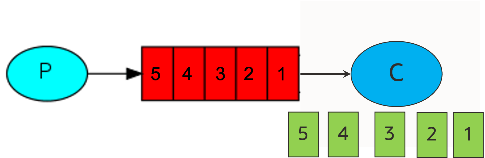
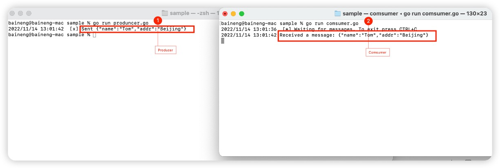
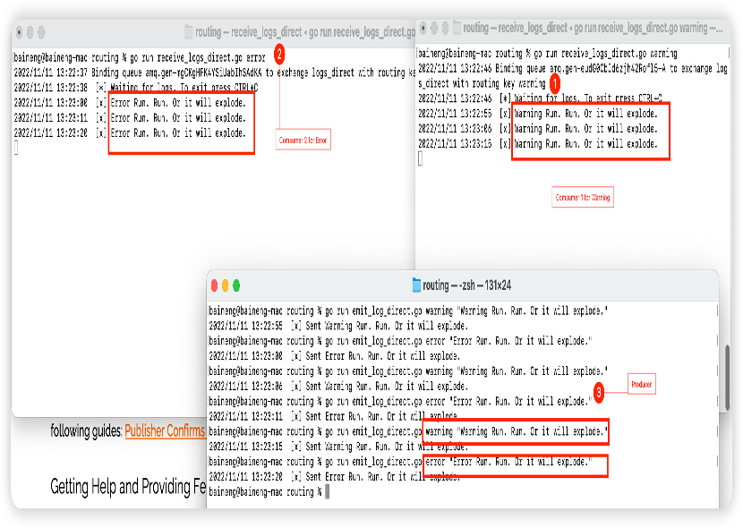

# RabbitMQ Code Example

## 1、 Github code download

```text
git remote add origin https://github.com/nengbai/rabbitmq.git

git branch -M main

git push -u origin main
```

## 2、代码实现

### 2.1、 简单队列



1. Producer 端代码

```text
   package main

import (
 "log"
 "os"
 "rabbitmq/lib"
 "strings"
)

func bodyForm(args []string) string {
 var s string
 if (len(args) < 2) || os.Args[1] == "" {
  s = "no Task"
 } else {
  s = strings.Join(args[1:], " ")
 }
 return s
}

func main() {
 conn, err := lib.RabbitMQConn()
 lib.ErrorHanding(err, "failed to connect to RabbitMQ")
 defer conn.Close()
 ch, err := conn.Channel()
 lib.ErrorHanding(err, "failed to open a channel")
 defer ch.Close()
 q, err := ch.QueueDeclare(
  "simple:queue", // name
  false,          // durable
  false,          // delete when unused
  false,          // exclusive
  false,          // no-wait
  nil,            // arguments
 )
 lib.ErrorHanding(err, "Failed to declare a queue")

 msgs, err := ch.Consume(
  q.Name, // queue
  "",     // consumer
  true,   // auto-ack
  false,  // exclusive
  false,  // no-local
  false,  // no-wait
  nil,    // args
 )
 lib.ErrorHanding(err, "Failed to register a consumer")

 var forever chan struct{}

 go func() {
  for d := range msgs {
   log.Printf("Received a message: %s", string(d.Body))
  }
 }()

 log.Printf(" [*] Waiting for messages. To exit press CTRL+C\n")
 <-forever
}

```

2.Comsumer 端代码

```text
package main

import (
 "log"
 "os"
 "rabbitmq/lib"
 "strings"
)

func bodyForm(args []string) string {
 var s string
 if (len(args) < 2) || os.Args[1] == "" {
  s = "no Task"
 } else {
  s = strings.Join(args[1:], " ")
 }
 return s
}

func main() {
 conn, err := lib.RabbitMQConn()
 lib.ErrorHanding(err, "failed to connect to RabbitMQ")
 defer conn.Close()
 ch, err := conn.Channel()
 lib.ErrorHanding(err, "failed to open a channel")
 defer ch.Close()
 q, err := ch.QueueDeclare(
  "simple:queue", // name
  false,          // durable
  false,          // delete when unused
  false,          // exclusive
  false,          // no-wait
  nil,            // arguments
 )
 lib.ErrorHanding(err, "Failed to declare a queue")

 msgs, err := ch.Consume(
  q.Name, // queue
  "",     // consumer
  true,   // auto-ack
  false,  // exclusive
  false,  // no-local
  false,  // no-wait
  nil,    // args
 )
 lib.ErrorHanding(err, "Failed to register a consumer")

 var forever chan struct{}

 go func() {
  for d := range msgs {
   log.Printf("Received a message: %s", string(d.Body))
  }
 }()

 log.Printf(" [*] Waiting for messages. To exit press CTRL+C\n")
 <-forever
}
```

3.测试结果

消费端之行程序produncer.go

```bash Producer
cd sample
go run produncer.go
```

消费端之行程序 Comsucer.go

```bash
cd sample
go run Comsucer.go
```



### 2.2、 工作队列模式


1. Producer 端代码

```text
package main

import (
 "log"
 "os"
 "rabbitmq/lib"
 "strings"

 "github.com/streadway/amqp"
)

func bodyForm(args []string) string {
 var s string
 if (len(args) < 2) || os.Args[1] == "" {
  s = "no Task"
 } else {
  s = strings.Join(args[1:], " ")
 }
 return s
}

func main() {
 conn, err := lib.RabbitMQConn()
 lib.ErrorHanding(err, "failed to connect to RabbitMQ")
 defer conn.Close()
 ch, err := conn.Channel()
 lib.ErrorHanding(err, "failed to open a channel")
 defer ch.Close()
 q, err := ch.QueueDeclare(
  "task:queue", // name
  false,        // durable
  false,        // delete when unused
  false,        // exclusive
  false,        // no-wait
  nil,          // arguments
 )
 lib.ErrorHanding(err, "Failed to declare a queue")
 // 定义一个消费者
 body := bodyForm(os.Args)
 err = ch.Publish(
  "",
  q.Name,
  false,
  false,
  amqp.Publishing{
   ContentType:  "text/plain",
   DeliveryMode: amqp.Persistent,
   Body:         []byte(body),
  },
 )
 lib.ErrorHanding(err, "Fail to publish a message !")
 log.Println("send message: s%", body)
}

```

`2`. Comsumer 端代码

```text
package main

import (
 "log"
 "rabbitmq/lib"
)

func main() {
 conn, err := lib.RabbitMQConn()
 lib.ErrorHanding(err, "failed to connect to RabbitMQ")
 defer conn.Close()
 ch, err := conn.Channel()
 lib.ErrorHanding(err, "failed to open a channel")
 defer ch.Close()
 q, err := ch.QueueDeclare(
  "task:queue", // name
  false,        // durable
  false,        // delete when unused
  false,        // exclusive
  false,        // no-wait
  nil,          // arguments
 )
 lib.ErrorHanding(err, "Failed to declare a queue")
 err = ch.Qos(
  1,
  0,
  false,
 )
 lib.ErrorHanding(err, "Fail to set Qos!")
 msgs, err := ch.Consume(
  q.Name,
  "",
  false,
  false,
  false,
  false,
  nil,
 )
 lib.ErrorHanding(err, "Fail to Register a comsumer!")
 forever := make(chan bool)
 go func() {
  for d := range msgs {
   log.Printf("Reviced a message:%s\n", string(d.Body))
   log.Println("Done")
   d.Ack(false)
  }

 }()
 log.Println(" [*] Wait for message.To text Press CTRL + C")
 <-forever
}

```

`3`. 测试结果

生产端之行程序: task.go

```bash Producer
cd task
go run task.go
```

消费端之行程序 worker.go

```bash
cd task
go run worker.go
```


### 2.3、 Fanout(发布/订阅)

")

1. Producer 端代码

```text
package main

import (
 "log"
 "os"
 "rabbitmq/lib"
 "strings"

 "github.com/streadway/amqp"
)

func main() {
 conn, err := lib.RabbitMQConn()
 lib.ErrorHanding(err, "failed to connect to RabbitMQ")
 defer conn.Close()
 ch, err := conn.Channel()
 lib.ErrorHanding(err, "failed to open a channel")
 defer ch.Close()

 err = ch.ExchangeDeclare(
  "exchange_logs", // name
  "fanout",        // type
  true,            // durable
  false,           // auto-deleted
  false,           // internal
  false,           // no-wait
  nil,             // arguments
 )
 lib.ErrorHanding(err, "Failed to declare an exchange")

 //ctx, cancel := context.WithTimeout(context.Background(), 5*time.Second)
 //defer cancel()

 body := bodyFrom(os.Args)

 err = ch.Publish(
  "exchange_logs", // exchange
  "",              // routing key
  false,           // mandatory
  false,           // immediate
  amqp.Publishing{
   ContentType: "text/plain",
   Body:        []byte(body),
  })
 lib.ErrorHanding(err, "Failed to publish a message")

 log.Printf(" [x] Sent %s\n", body)
}

func bodyFrom(args []string) string {
 var s string
 if (len(args) < 2) || os.Args[1] == "" {
  s = "hello"
 } else {
  s = strings.Join(args[1:], " ")
 }
 return s
}

```

'2'. Consumer 端代码

```text
package main

import (
 "log"
 "rabbitmq/lib"
)

func main() {
 conn, err := lib.RabbitMQConn()
 lib.ErrorHanding(err, "failed to connect to RabbitMQ")
 defer conn.Close()
 ch, err := conn.Channel()
 lib.ErrorHanding(err, "failed to open a channel")
 defer ch.Close()

 err = ch.ExchangeDeclare(
  "exchange_logs", // exchange name
  "fanout",        // type
  true,            // durable
  false,           // auto-deleted
  false,           // internal
  false,           // no-wait
  nil,             // arguments
 )
 lib.ErrorHanding(err, "Failed to declare an exchange")

 q, err := ch.QueueDeclare(
  "",    // name
  false, // durable
  false, // delete when unused
  true,  // exclusive
  false, // no-wait
  nil,   // arguments
 )
 lib.ErrorHanding(err, "Failed to declare a queue")

 err = ch.QueueBind(
  q.Name,          // queue name
  "",              // routing key
  "exchange_logs", // exchange
  false,
  nil,
 )
 lib.ErrorHanding(err, "Failed to bind a queue")

 msgs, err := ch.Consume(
  q.Name, // queue
  "",     // consumer
  true,   // auto-ack
  false,  // exclusive
  false,  // no-local
  false,  // no-wait
  nil,    // args
 )
 lib.ErrorHanding(err, "Failed to register a consumer")

 var forever chan struct{}

 go func() {
  for d := range msgs {
   log.Printf(" [x] %s", string(d.Body))
  }
 }()

 log.Println(" [*] Waiting for logs. To exit press CTRL+C")
 <-forever
}


```

'3'. 测试结果

消费端之行程序 receive_logs.go

```bash
cd fanout
go run receive_logs.go
```

生产端之行程序: emit_log.go

```bash Producer
cd fanout
go run emit_log.go 1
go run emit_log.go 2
go run emit_log.go 3
go run emit_log.go 4
go run emit_log.go 5
```

")

### 2.4、 Routing模式


1. Producer 端代码

```text
package main

import (
 "log"
 "os"
 "rabbitmq/lib"
 "strings"

 "github.com/streadway/amqp"
)

func failOnError(err error, msg string) {
 if err != nil {
  log.Panicf("%s: %s", msg, err)
 }
}

func main() {
 conn, err := lib.RabbitMQConn()
 lib.ErrorHanding(err, "failed to connect to RabbitMQ")
 defer conn.Close()
 ch, err := conn.Channel()
 lib.ErrorHanding(err, "failed to open a channel")
 defer ch.Close()

 err = ch.ExchangeDeclare(
  "logs_direct", // name
  "direct",      // type
  true,          // durable
  false,         // auto-deleted
  false,         // internal
  false,         // no-wait
  nil,           // arguments
 )
 lib.ErrorHanding(err, "Failed to declare an exchange")

 //ctx, cancel := context.WithTimeout(context.Background(), 5*time.Second)
 //defer cancel()

 body := bodyFrom(os.Args)
 err = ch.Publish(
  "logs_direct",         // exchange
  severityFrom(os.Args), // routing key
  false,                 // mandatory
  false,                 // immediate
  amqp.Publishing{
   ContentType: "text/plain",
   Body:        []byte(body),
  })
 failOnError(err, "Failed to publish a message")

 log.Printf(" [x] Sent %s", body)
}

func bodyFrom(args []string) string {
 var s string
 if (len(args) < 3) || os.Args[2] == "" {
  s = "hello"
 } else {
  s = strings.Join(args[2:], " ")
 }
 return s
}

func severityFrom(args []string) string {
 var s string
 if (len(args) < 2) || os.Args[1] == "" {
  s = "info"
 } else {
  s = os.Args[1]
 }
 return s
}

```

'2'. Consumer 端代码

```text
package main

import (
 "log"
 "os"
 "rabbitmq/lib"
)

func main() {
 conn, err := lib.RabbitMQConn()
 lib.ErrorHanding(err, "failed to connect to RabbitMQ")
 defer conn.Close()
 ch, err := conn.Channel()
 lib.ErrorHanding(err, "failed to open a channel")
 defer ch.Close()

 err = ch.ExchangeDeclare(
  "logs_direct", // name
  "direct",      // type
  true,          // durable
  false,         // auto-deleted
  false,         // internal
  false,         // no-wait
  nil,           // arguments
 )
 lib.ErrorHanding(err, "Failed to declare an exchange")

 q, err := ch.QueueDeclare(
  "",    // name
  false, // durable
  false, // delete when unused
  true,  // exclusive
  false, // no-wait
  nil,   // arguments
 )
 lib.ErrorHanding(err, "Failed to declare a queue")

 if len(os.Args) < 2 {
  log.Printf("Usage: %s [info] [warning] [error]\n", os.Args[0])
  os.Exit(0)
 }
 for _, s := range os.Args[1:] {
  log.Printf("Binding queue %s to exchange %s with routing key %s\n",
   q.Name, "logs_direct", s)
  err = ch.QueueBind(
   q.Name,        // queue name
   s,             // routing key
   "logs_direct", // exchange
   false,
   nil)
  lib.ErrorHanding(err, "Failed to bind a queue")
 }

 msgs, err := ch.Consume(
  q.Name, // queue
  "",     // consumer
  true,   // auto ack
  false,  // exclusive
  false,  // no local
  false,  // no wait
  nil,    // args
 )
 lib.ErrorHanding(err, "Failed to register a consumer")

 var forever chan struct{}

 go func() {
  for d := range msgs {
   log.Printf(" [x] %s", string(d.Body))
  }
 }()

 log.Printf(" [*] Waiting for logs. To exit press CTRL+C\n")
 <-forever
}


```

'3'. 测试结果

消费端之行程序 receive_logs_direct.go

```bash
cd routing
go run receive_logs_direct.go warning
go run receive_logs_direct.go error
```

生产端之行程序: emit_log_direct.go

```bash Producer
cd routing
go run emit_log_direct.go warning "Notice, this is Warning." 
go run emit_log_direct.go error "Run. Run. Or it will explode."
```


### 2.5、 Topics模式



1. Producer 端代码

```text
package main

import (
 "log"
 "os"
 "rabbitmq/lib"
 "strings"

 "github.com/streadway/amqp"
)

func main() {
 conn, err := lib.RabbitMQConn()
 lib.ErrorHanding(err, "failed to connect to RabbitMQ")
 defer conn.Close()
 ch, err := conn.Channel()
 lib.ErrorHanding(err, "failed to open a channel")
 defer ch.Close()

 err = ch.ExchangeDeclare(
  "logs_topic", // name
  "topic",      // type
  true,         // durable
  false,        // auto-deleted
  false,        // internal
  false,        // no-wait
  nil,          // arguments
 )
 lib.ErrorHanding(err, "Failed to declare an exchange")

 // ctx, cancel := context.WithTimeout(context.Background(), 5*time.Second)
 // defer cancel()

 body := bodyFrom(os.Args)
 err = ch.Publish(
  "logs_topic",          // exchange
  severityFrom(os.Args), // routing key
  false,                 // mandatory
  false,                 // immediate
  amqp.Publishing{
   ContentType: "text/plain",
   Body:        []byte(body),
  })
 lib.ErrorHanding(err, "Failed to publish a message")

 log.Printf(" [x] Sent %s", body)
}

func bodyFrom(args []string) string {
 var s string
 if (len(args) < 3) || os.Args[2] == "" {
  s = "hello"
 } else {
  s = strings.Join(args[2:], " ")
 }
 return s
}

func severityFrom(args []string) string {
 var s string
 if (len(args) < 2) || os.Args[1] == "" {
  s = "anonymous.info"
 } else {
  s = os.Args[1]
 }
 return s
}

```

'2'. Consumer 端代码

```text
package main

import (
 "log"
 "os"
 "rabbitmq/lib"
)

func main() {
 conn, err := lib.RabbitMQConn()
 lib.ErrorHanding(err, "failed to connect to RabbitMQ")
 defer conn.Close()
 ch, err := conn.Channel()
 lib.ErrorHanding(err, "failed to open a channel")
 defer ch.Close()

 err = ch.ExchangeDeclare(
  "logs_topic", // name
  "topic",      // type
  true,         // durable
  false,        // auto-deleted
  false,        // internal
  false,        // no-wait
  nil,          // arguments
 )
 lib.ErrorHanding(err, "Failed to declare an exchange")

 q, err := ch.QueueDeclare(
  "",    // name
  false, // durable
  false, // delete when unused
  true,  // exclusive
  false, // no-wait
  nil,   // arguments
 )
 lib.ErrorHanding(err, "Failed to declare a queue")

 if len(os.Args) < 2 {
  log.Printf("Usage: %s [binding_key]...", os.Args[0])
  os.Exit(0)
 }
 for _, s := range os.Args[1:] {
  log.Printf("Binding queue %s to exchange %s with routing key %s",
   q.Name, "logs_topic", s)
  err = ch.QueueBind(
   q.Name,       // queue name
   s,            // routing key
   "logs_topic", // exchange
   false,
   nil)
  lib.ErrorHanding(err, "Failed to bind a queue")
 }

 msgs, err := ch.Consume(
  q.Name, // queue
  "",     // consumer
  true,   // auto ack
  false,  // exclusive
  false,  // no local
  false,  // no wait
  nil,    // args
 )
 lib.ErrorHanding(err, "Failed to register a consumer")

 var forever chan struct{}

 go func() {
  for d := range msgs {
   log.Printf(" [x] %s", string(d.Body))
  }
 }()

 log.Printf(" [*] Waiting for logs. To exit press CTRL+C\n")
 <-forever
}


```

'3'. 测试结果

消费端之行程序 receive_logs_topic.go

```bash
cd topic
go run receive_logs_topic.go "#"
go run receive_logs_topic.go critical
```

生产端之行程序: emit_log_topic.go

```bash Producer
cd topic
# shell1
go run receive_logs_topic.go "#"
​
# shell2
go run receive_logs_topic.go "kern.*"
​
# shell3
go run receive_logs_topic.go "*.critical"
​
# shell4
go run receive_logs_topic.go "kern.*" "*.critical"
​
# shell5 
go run emit_log_topic.go "kern.critical" "A critical kernel error"
```


### 2.6、 RPC模式


1. Server 端代码

```text
package main

import (
 "log"
 "rabbitmq/lib"
 "strconv"

 "github.com/streadway/amqp"
)

func fib(n int) int {
 if n == 0 {
  return 0
 } else if n == 1 {
  return 1
 } else {
  return fib(n-1) + fib(n-2)
 }
}

func main() {
 conn, err := lib.RabbitMQConn()
 lib.ErrorHanding(err, "failed to connect to RabbitMQ")
 defer conn.Close()
 ch, err := conn.Channel()
 lib.ErrorHanding(err, "failed to open a channel")
 defer ch.Close()

 q, err := ch.QueueDeclare(
  "rpc_queue", // name
  false,       // durable
  false,       // delete when unused
  false,       // exclusive
  false,       // no-wait
  nil,         // arguments
 )
 lib.ErrorHanding(err, "Failed to declare a queue")

 err = ch.Qos(
  1,     // prefetch count
  0,     // prefetch size
  false, // global
 )
 lib.ErrorHanding(err, "Failed to set QoS")

 msgs, err := ch.Consume(
  q.Name, // queue
  "",     // consumer
  false,  // auto-ack
  false,  // exclusive
  false,  // no-local
  false,  // no-wait
  nil,    // args
 )
 lib.ErrorHanding(err, "Failed to register a consumer")

 var forever chan struct{}

 go func() {
  // ctx, cancel := context.WithTimeout(context.Background(), 5*time.Second)
  // defer cancel()
  for d := range msgs {
   n, err := strconv.Atoi(string(d.Body))
   lib.ErrorHanding(err, "Failed to convert body to integer")

   log.Printf(" [.] fib(%d)", n)
   response := fib(n)

   err = ch.Publish(
    "",        // exchange
    d.ReplyTo, // routing key
    false,     // mandatory
    false,     // immediate
    amqp.Publishing{
     ContentType:   "text/plain",
     CorrelationId: d.CorrelationId,
     Body:          []byte(strconv.Itoa(response)),
    })
   lib.ErrorHanding(err, "Failed to publish a message")

   d.Ack(false)
  }
 }()

 log.Printf(" [*] Awaiting RPC requests")
 <-forever
}


```

'2'. Client 端代码

```text
package main

import (
 "log"
 "math/rand"
 "os"
 "rabbitmq/lib"
 "strconv"
 "strings"
 "time"

 "github.com/streadway/amqp"
)

func randomString(l int) string {
 bytes := make([]byte, l)
 for i := 0; i < l; i++ {
  bytes[i] = byte(randInt(65, 90))
 }
 return string(bytes)
}

func randInt(min int, max int) int {
 return min + rand.Intn(max-min)
}

func fibonacciRPC(n int) (res int, err error) {
 conn, err := lib.RabbitMQConn()
 lib.ErrorHanding(err, "failed to connect to RabbitMQ")
 defer conn.Close()
 ch, err := conn.Channel()
 lib.ErrorHanding(err, "failed to open a channel")
 defer ch.Close()

 q, err := ch.QueueDeclare(
  "",    // name
  false, // durable
  false, // delete when unused
  true,  // exclusive
  false, // noWait
  nil,   // arguments
 )
 lib.ErrorHanding(err, "Failed to declare a queue")

 msgs, err := ch.Consume(
  q.Name, // queue
  "",     // consumer
  true,   // auto-ack
  false,  // exclusive
  false,  // no-local
  false,  // no-wait
  nil,    // args
 )
 lib.ErrorHanding(err, "Failed to register a consumer")

 corrId := randomString(32)

 // ctx, cancel := context.WithTimeout(context.Background(), 5*time.Second)
 // defer cancel()

 err = ch.Publish(
  "",          // exchange
  "rpc_queue", // routing key
  false,       // mandatory
  false,       // immediate
  amqp.Publishing{
   ContentType:   "text/plain",
   CorrelationId: corrId,
   ReplyTo:       q.Name,
   Body:          []byte(strconv.Itoa(n)),
  })
 lib.ErrorHanding(err, "Failed to publish a message")

 for d := range msgs {
  if corrId == d.CorrelationId {
   res, err = strconv.Atoi(string(d.Body))
   lib.ErrorHanding(err, "Failed to convert body to integer")
   break
  }
 }

 return
}

func main() {
 rand.Seed(time.Now().UTC().UnixNano())

 n := bodyFrom(os.Args)

 log.Printf(" [x] Requesting fib(%d)", n)
 res, err := fibonacciRPC(n)
 lib.ErrorHanding(err, "Failed to handle RPC request")

 log.Printf(" [.] Got %d", res)
}

func bodyFrom(args []string) int {
 var s string
 if (len(args) < 2) || os.Args[1] == "" {
  s = "30"
 } else {
  s = strings.Join(args[1:], " ")
 }
 n, err := strconv.Atoi(s)
 lib.ErrorHanding(err, "Failed to convert arg to integer")
 return n
}


```

'3'. 测试结果

服务器端之行程序: rpc_server.go

```bash RPC Server
cd rpc
go run rpc_server.go
```

客户端之行程序 rpc_client.go

```bash RPC Client
cd rpc
go run rpc_server.go 5
```


