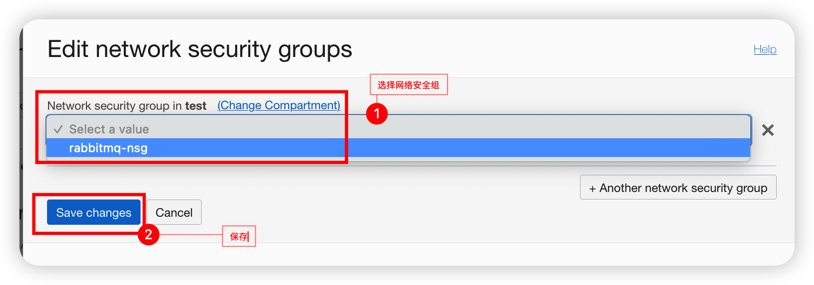

# RabbitMQ 安装教程

## 1、 环境与安装准备

### 1.1 安装规划

本实验前提已经在OCI中创建好VCN和VM，且每台vm增加200G块存储。
序号      | 服务器名  | IP地址  | 数据和日志存储路径 | 对应盘符
---------|----------|---------|---------|---------|---------|
1   |hand-rabbitmq-node1| 10.0.0.226|/var/log/rabbitmq and /var/lib/rabbitmq |/dev/sdb  
2   |hand-rabbitmq-node2|10.0.0.208 |/var/log/rabbitmq and /var/lib/rabbitmq |/dev/sdb  
3   |hand-rabbitmq-node3|10.0.0.238 |/var/log/rabbitmq and /var/lib/rabbitmq |/dev/sdb  

在对应VM的/etc/hosts中增加对应的域名解释

```text
10.0.0.226 hand-rabbitmq-node1
10.0.0.208 hand-rabbitmq-node2
10.0.0.238 hand-rabbitmq-node3
```

### 1.2 环境准备

* 服务器环境准备
  
依次在服务器：hand-rabbitmq-node1，hand-rabbitmq-node2，hand-rabbitmq-node3上执行

```bash
# 关闭selinux模式为 /etc/selinux/config  SELINUX=permissive
[root@hand-rabbitmq-node3 ~]#setenforce 0
[root@hand-rabbitmq-node3 ~]# getenforce
Permissive
```

* 创建文件系统

```bash
# 新建RabbitMQ 数据存储文件系统
[root@hand-rabbitmq-node1 ~]# pvcreate /dev/sdb
  Physical volume "/dev/sdb" successfully created.
```

```bash
[root@hand-rabbitmq-node1 ~]# vgcreate datavg /dev/sdb
  Volume group "datavg" successfully created
[root@hand-rabbitmq-node1 ~]# lvcreate -n lvrabbitmq -L  100G datavg
  Logical volume "lvrabitmq" created.
[root@hand-rabbitmq-node1 ~]# lvcreate -n lvrabbitmqlog -l 100%FREE datavg
  Logical volume "lvrabbitmqlog" created.
```

```bash
[root@hand-rabbitmq-node1 ~]# mkfs.xfs /dev/datavg/lvrabbitmq
[root@hand-rabbitmq-node1 ~]# mkfs.xfs /dev/datavg/lvrabbitmqlog
[root@hand-rabbitmq-node1 ~]# mkdir /var/log/rabbitmq
[root@hand-rabbitmq-node1 ~]# mkdir /var/lib/rabbitmq
```

```bash
[root@hand-rabbitmq-node1 ~]# lsblk -f
NAME               FSTYPE      LABEL UUID                                   MOUNTPOINT
sda                                                                         
├─sda1             vfat              6AD3-CAF6                              /boot/efi
├─sda2             xfs               670a020a-d604-4da4-a096-65c005812ef2   /boot
└─sda3             LVM2_member       fpoIDN-OdPb-RvyS-0pPP-wSpq-ECy1-2qWXNb 
  ├─ocivolume-root xfs               ac429d9c-399a-4194-8e43-c92679901401   /
  └─ocivolume-oled xfs               b4ce40f5-2ade-42e5-8371-b67fcc5e1e06   /var/oled
sdb                LVM2_member       FoLlbP-RfDc-wym6-mooe-8Mg9-SNtG-fnAyVH 
└─datavg-lvrabitmq xfs               bd6f0a53-ed8c-404b-9325-da981fee3bf1   
```

* 增加文件系统挂载点

```bash
[root@hand-rabbitmq-node1 ~]# vi /etc/fstab 
UUID=3e2833e3-01b6-4806-8914-78c0b0a424a6  /var/log/rabbitmq  xfs     defaults        0 2
UUID=4e2833e3-01b6-4806-8944-78c0b0a4446  /var/lib/rabbitmq   xfs     defaults        0 2
```

* 挂载文件系统/var/log/rabbitmq 和 /var/lib/rabbitmq

```bash
[root@hand-rabbitmq-node1 ~]# mount -a
[root@hand-rabbitmq-node1 ~]# df -h
Filesystem                    Size  Used Avail Use% Mounted on
devtmpfs                      7.6G     0  7.6G   0% /dev
tmpfs                         7.7G     0  7.7G   0% /dev/shm
tmpfs                         7.7G  8.7M  7.7G   1% /run
tmpfs                         7.7G     0  7.7G   0% /sys/fs/cgroup
/dev/mapper/ocivolume-root     36G  8.0G   28G  23% /
/dev/mapper/ocivolume-oled     10G  111M  9.9G   2% /var/oled
/dev/sda2                    1014M  324M  691M  32% /boot
/dev/sda1                     100M  5.0M   95M   6% /boot/efi
tmpfs                         1.6G     0  1.6G   0% /run/user/0
tmpfs                         1.6G     0  1.6G   0% /run/user/987
tmpfs                         1.6G     0  1.6G   0% /run/user/1000
/dev/mapper/datavg-lvrabitmqlog  100G  746M  99G   1% /var/log/rabbitmq
/dev/mapper/datavg-lvrabitmq  100G  746M  100G   1% /var/lib/rabbitmq
```

* 关闭系统防火墙

```bash
systemctl stop firewalld
```

## 2、下载与安装RabbitMQ

### 2.1 下载安装Erlang

RabbitMQ是采用 Erlang语言开发的，所以系统环境必须提供 Erlang环境，需要安装 Erlang
Erlang和RabbitMQ版本对照：
下载地址：<https://cloudsmith.io/~rabbitmq/repos/rabbitmq-erlang/setup/#formats-rpm>

这里安装最新版本3.11.0的RabbitMQ，对应的Erlang版本推荐23.x，我们下载：erlang-25.1.1-1.el8.x86_64.rpm

```bash
curl -1sLf \
  'https://dl.cloudsmith.io/public/rabbitmq/rabbitmq-erlang/setup.rpm.sh' \
  | sudo -E bash
  ```

 安装完成后输入如下指令查看版本号：

 ```bash
[root@hand-rabbitmq-node1 ~]# erl -version
Erlang (SMP,ASYNC_THREADS) (BEAM) emulator version 13.1.1
 ```

### 2.2 下载RabbitMQ

下载地址：<https://rabbitmq.com/download.html>
选择对应的系统版本点击下载，下载后会得到.rpm文件

```bash
wget https://github.com/rabbitmq/rabbitmq-server/releases/download/v3.11.0/rabbitmq-server-3.11.0-1.el8.noarch.rpm

```

### 2.3 安装RabbitMQ

1. 在RabiitMQ安装过程中需要依赖socat插件，首先安装该插件

```bash
sudo yum install socat logrotate -y
```

2.安装RabbitMQ的安装包

```bash
sudo yum install rabbitmq-server-3.11.0-1.el8.noarch.rpm -y
```

```bash
Last metadata expiration check: 0:00:48 ago on Tue 11 Oct 2022 03:14:00 AM GMT.
Dependencies resolved.
=========================================================================================================================================================================================================
 Package                                          Architecture                            Version                                        Repository                                                 Size
=========================================================================================================================================================================================================
Installing:
 rabbitmq-server                                  noarch                                  3.11.0-1.el8                                   @commandline                                               17 M
Installing dependencies:
 erlang                                           x86_64                                  25.1.1-1.el8                                   rabbitmq-rabbitmq-erlang                                   20 M

Transaction Summary
=========================================================================================================================================================================================================
Install  2 Packages

Total size: 37 M
Total download size: 20 M
Installed size: 58 M
Is this ok [y/N]: y
Downloading Packages:
erlang-25.1.1-1.el8.x86_64.rpm                                                                                                                                           4.1 MB/s |  20 MB     00:04    
---------------------------------------------------------------------------------------------------------------------------------------------------------------------------------------------------------
Total                                                                                                                                                                    4.1 MB/s |  20 MB     00:04     
Running transaction check
Transaction check succeeded.
Running transaction test
Transaction test succeeded.
Running transaction
  Preparing        :                                                                                                                                                                                 1/1 
  Installing       : erlang-25.1.1-1.el8.x86_64                                                                                                                                                      1/2 
  Running scriptlet: rabbitmq-server-3.11.0-1.el8.noarch                                                                                                                                             2/2 
  Installing       : rabbitmq-server-3.11.0-1.el8.noarch                                                                                                                                             2/2 
  Running scriptlet: rabbitmq-server-3.11.0-1.el8.noarch                                                                                                                                             2/2 
[/usr/lib/tmpfiles.d/rabbitmq-server.conf:1] Line references path below legacy directory /var/run/, updating /var/run/rabbitmq → /run/rabbitmq; please update the tmpfiles.d/ drop-in file accordingly.

  Verifying        : erlang-25.1.1-1.el8.x86_64                                                                                                                                                 1/2 
  Verifying        : rabbitmq-server-3.11.0-1.el8.noarch                                                                                                                                             2/2 

Installed:
  erlang-25.1.1-1.el8.x86_64
  rabbitmq-server-3.11.0-1.el8.noarch                                                                    

Complete!
```

### 2.4 启动RabbitMQ服务

1. 启动rabbitmq

 ```bash
[root@hand-rabbitmq-node3 ~]# systemctl start rabbitmq-server
```

2.查看rabbitmq状态

 ```bash
[root@hand-rabbitmq-node3 ~]# systemctl status rabbitmq-server
```

## 3、RabbitMQWeb管理界面及授权操作

以下操作需要登陆rabbitmq vm服务器操作，如果vm服务器无公网IP,需要通过Bastion或同vnc中可登录rabbitmq vm服务器的跳板机器。

### 3.1 安装启动RabbitMQWeb管理界面

  打开RabbitMQWeb管理界面插件

```bash
rabbitmq-plugins enable rabbitmq_management
rabbitmq-plugins list
```

### 3.2 添加远程用户

rabbitmq有一个默认的账号密码guest，但该情况仅限于本机localhost进行访问，所以需要添加一个远程登录的用户。

1. 添加用户

```text

rabbitmqctl add_user 用户名 密码
```

2.设置用户角色,分配操作权限

```text
rabbitmqctl set_user_tags 用户名 角色
```

3.为用户添加资源权限(授予访问虚拟机根节点的所有权限)

```text
rabbitmqctl set_permissions -p / 用户名 ".*" ".*" ".*"
```

角色有四种：
administrator：可以登录控制台、查看所有信息、并对rabbitmq进行管理
monToring：监控者；登录控制台，查看所有信息
policymaker：策略制定者；登录控制台指定策略
managment：普通管理员；登录控制
Example: 创建用户admin，密码Pass@word1，设置adminstator角色，赋予所有权限

```bash
[root@hand-rabbitmq-node1 ~]# rabbitmqctl add_user admin Pass@word1
Adding user "admin" ...
Done. Don't forget to grant the user permissions to some virtual hosts! See 'rabbitmqctl help set_permissions' to learn more.
[root@hand-rabbitmq-node1 ~]# rabbitmqctl set_user_tags admin administrator
Setting tags for user "admin" to [administrator] ...
[root@hand-rabbitmq-node1 ~]# rabbitmqctl set_permissions -p / admin ".*" ".*" ".*"
Setting permissions for user "admin" in vhost "/" ...

```

4.其他指令：

修改密码

```text
rabbitmqctl change_ password 用户名 新密码
```

 删除用户

 ```text
rabbitmqctl delete_user 用户名
```

 查看用户清单

```text
rabbitmqctl list_users
```

## 4、负载均衡

### 4.1 创建负载均衡

1. 选择Networking->Virtual Cloud Networking


2. Load Balancers->Create Load Balancer


3. 选择负载均衡器类型为Network Load Balancer


4. 输入Load Balancer Name 和选择负载均衡访问类型：Public


5. 增加后台服务监听协议和端口


6. 增加后台服务


### 4.2 安全规则设置

1.增加网络安全组策略

  选择RabbitMQ VM所在的VCN

  点击创建网络安全组

  增加网络安全组的安全策略，仅允许15672和5672可访问


2.增加网络安全组到对应的RabbitMQ VM

  下面步骤需要在RabbitMQ VM上增加，如：RabbitMQ VM hand-rabbitmq-node1，hand-rabbitmq-node2，hand-rabbitmq-node3



### 4.3 测试验证

浏览器中输入负载均衡外网IP + 后台服务端口，例如：<http://131.186.23.190:15672>

1. 登管理页面


2. 管理RabbitMQ 集群


  恭喜您，您的RabbitMQ 集群已经Ready，参照code-example 准备写代码.....