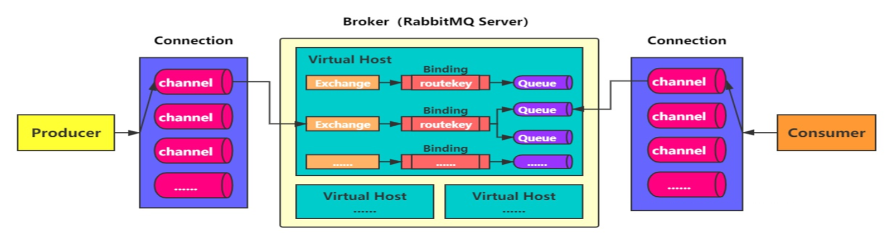
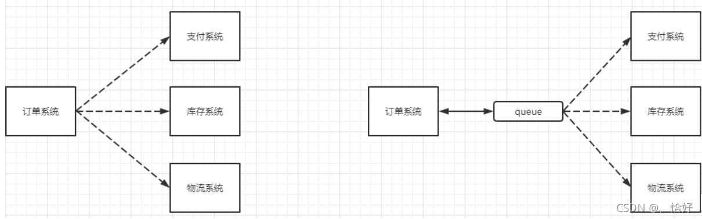
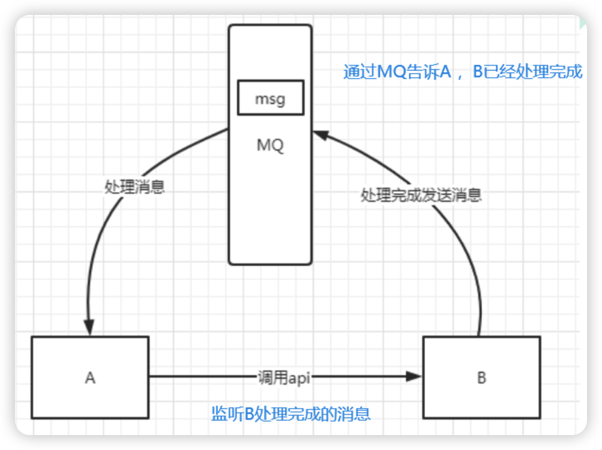

# RabbitMQ

## 1、 简介

RabbitMQ是基于Erlang开发的，遵循AMQP(Advanced Message Queuing Protocol)协议的消息中件。其组件包括Connection,Exchange，队列和消息4部分组成。生产者通过Exchange路由规则把消息写入对应队列，消息可持续存储在队列，消息主动推给消费者，已消费的消息从队列中删除。

* Connection: 为生产者和消费者构建安全通道。
* Exchange: 设置路由规则，对应到相应的队列。
* 队列：简单队列和工作队列。
  

## 2、   应用场景

  1. 微服务和无服务器应用程的解藕，消息可靠消费。

     如电商系统：支付，库存，物流都交给MQ做消息可靠消费。
    

  2. 异步处理

    服务之间异步调用：
    例如: A调用B，B需要花费很长时间执行，但是A需要得B执行结果。

    过去实现两种方式：
    - A过一段时间去再调用B的API查询结果。
    - 或者A提供一个callback API，B执行完之后调用AP通知A服务。
  
    以上两种都不是很优雅，引入消息中间件可以很好第解决：
    - A调用B服务后，只需要监听B处理完成的消息，当B处理完成后，会发送一条消息给MQ
    - MQ 会将此消息转发给A服务。
   

    这样，A服务既不用循环调用B的查询API，也不用提供callback API；同样，B服务也不用做这些操作，A服务还能及时的得到异步处理成功的消息。
  
   3. 流量消峰
    简单来说： 就是在访问量剧增的情况下，比如6.18/11.11下单的人多，但这个应用仍然要运行，就可以使用消息中间件采用队列的形式减少突然访问的压力。
   举个电商订单系统例子:

* 正常情况: 订单系统最多能处理一万次订单，这个处理能力应付正常时段的下单时绰绰有余，正常时段我们下单一秒后就能返回结果。
* 高峰期:  当来临，可能有2～10/100万次下单，这时候的系统是处理不了，只能限制订单超过一万后不允许用户下单。
  引入消息队列做缓冲： 可以取消这个限制，把一秒内下的订单分散成一段时间来处理，可能有些用户在下单十几秒后才能收到下单成功的操作但是，比不能下单的体验要好。
