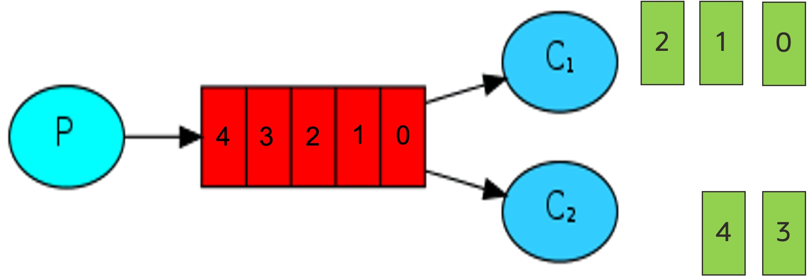

# OCI Queue Code Example

## 1、 Github code download

```text
git remote add origin https://github.com/nengbai/oracle-oqs.git

git branch -M main

git push -u origin main
```

## 2、代码实现

### 2.1、 标准队列模式



1. Producer 端代码
   
```text
package main

import (
	"fmt"
	"oqs/producer"
	"oqs/queue"
	"strconv"

	"github.com/gofrs/uuid"
)

type Message struct {
	Typename string `json:"typename,omitempty"`
	UUID     string `json:"uuid,omitempty"`
	Data     []byte `json:"data,omitempty"`
}

func main() {
	const MessageEndpoint = "https://cell-1.queue.messaging.ap-tokyo-1.oci.oraclecloud.com"
	qid := "ocid1.queue.oc1.ap-tokyo-1.amaaaaaaj37ijuqa7dumi4aueyrmnhfu5s2mawtbecwtxthutgmoapjhbaba"
	id, _ := uuid.NewV4()
	ids := id.String()
	mac := queue.GetLocalMac()
	ids = mac + ids
	var in string
	var data *Message
	for i := 0; i < 50; i++ {
		in = strconv.Itoa(i)
		fmt.Println(in)
		data = &Message{
			Typename: "order1",
			UUID:     ids,
			Data:     []byte(in),
		}

		content := queue.Encode(data)
		resp, err := producer.PutMessages(ids, qid, MessageEndpoint, content)
		fmt.Println("------")
		//resp, err := consumer.GetMessages(ids, qid, MessageEndpoint)
		if err != nil {
			fmt.Println(err)
		}
		fmt.Println(resp)
	}
}
```


2.Comsumer 端代码

```text
package main

import (
	"encoding/json"
	"fmt"
	"oqs/queue"
        "oqs/consumer"
	// "log"

	"github.com/gofrs/uuid"
)

type Message struct {
	Typename string `json:"Typename,omitempty"`
	UUID     string `json:"uuid,omitempty"`
	Data     []byte `json:"data,omitempty"`
}

func main() {
	const MessageEndpoint = "https://cell-1.queue.messaging.ap-tokyo-1.oci.oraclecloud.com"
	qid := "ocid1.queue.oc1.ap-tokyo-1.amaaaaaaj37ijuqa7dumi4aueyrmnhfu5s2mawtbecwtxthutgmoapjhbaba"
	id, _ := uuid.NewV4()
	ids := id.String()
	mac := queue.GetLocalMac()
	ids = mac + ids
	//queue.GetQueue(ids, qid)
	fmt.Println("------")
	resp, err := consumer.GetMessages(ids, qid, MessageEndpoint)
	if err != nil {
		fmt.Println(err)
	}
	var message Message

	//data := make(map[string]interface{})
	//var forever chan struct{}
	//go func() {
		
	for _, v := range resp.Messages {
		messageReceipt := queue.Decode(*v.Content)
		err := json.Unmarshal([]byte(messageReceipt), &message)
		if err != nil {
			fmt.Println(err)
		}
		fmt.Println("message is: ", message.Typename,string(message.Data) )
	}
	//}()
	//	log.Println(" [*] Waiting for logs. To exit press CTRL+C")
	//	<-forever

}

```

3.测试结果

消费端之行程序produncer.go

```bash Producer
cd sample
go run produncer.go
```

消费端之行程序 Comsucer.go

```bash
cd sample
go run Comsucer.go
```
