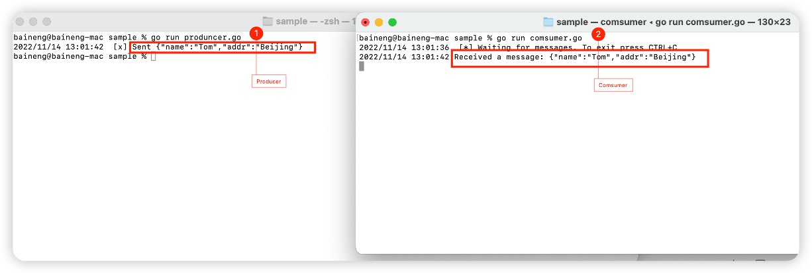

# OCI Queue Code Example

## 1、 Github code download

```text
git remote add origin https://github.com/nengbai/oracle-oqs.git

git branch -M main

git push -u origin main
```

## 2、代码实现

### 2.1、 标准队列模式


1. Producer 端代码

```text
   package main

import (
 "log"
 "os"
 "rabbitmq/lib"
 "strings"
)

func bodyForm(args []string) string {
 var s string
 if (len(args) < 2) || os.Args[1] == "" {
  s = "no Task"
 } else {
  s = strings.Join(args[1:], " ")
 }
 return s
}

func main() {
 conn, err := lib.RabbitMQConn()
 lib.ErrorHanding(err, "failed to connect to RabbitMQ")
 defer conn.Close()
 ch, err := conn.Channel()
 lib.ErrorHanding(err, "failed to open a channel")
 defer ch.Close()
 q, err := ch.QueueDeclare(
  "simple:queue", // name
  false,          // durable
  false,          // delete when unused
  false,          // exclusive
  false,          // no-wait
  nil,            // arguments
 )
 lib.ErrorHanding(err, "Failed to declare a queue")

 msgs, err := ch.Consume(
  q.Name, // queue
  "",     // consumer
  true,   // auto-ack
  false,  // exclusive
  false,  // no-local
  false,  // no-wait
  nil,    // args
 )
 lib.ErrorHanding(err, "Failed to register a consumer")

 var forever chan struct{}

 go func() {
  for d := range msgs {
   log.Printf("Received a message: %s", string(d.Body))
  }
 }()

 log.Printf(" [*] Waiting for messages. To exit press CTRL+C\n")
 <-forever
}

```

2.Comsumer 端代码

```text
package main

import (
 "log"
 "os"
 "rabbitmq/lib"
 "strings"
)

func bodyForm(args []string) string {
 var s string
 if (len(args) < 2) || os.Args[1] == "" {
  s = "no Task"
 } else {
  s = strings.Join(args[1:], " ")
 }
 return s
}

func main() {
 conn, err := lib.RabbitMQConn()
 lib.ErrorHanding(err, "failed to connect to RabbitMQ")
 defer conn.Close()
 ch, err := conn.Channel()
 lib.ErrorHanding(err, "failed to open a channel")
 defer ch.Close()
 q, err := ch.QueueDeclare(
  "simple:queue", // name
  false,          // durable
  false,          // delete when unused
  false,          // exclusive
  false,          // no-wait
  nil,            // arguments
 )
 lib.ErrorHanding(err, "Failed to declare a queue")

 msgs, err := ch.Consume(
  q.Name, // queue
  "",     // consumer
  true,   // auto-ack
  false,  // exclusive
  false,  // no-local
  false,  // no-wait
  nil,    // args
 )
 lib.ErrorHanding(err, "Failed to register a consumer")

 var forever chan struct{}

 go func() {
  for d := range msgs {
   log.Printf("Received a message: %s", string(d.Body))
  }
 }()

 log.Printf(" [*] Waiting for messages. To exit press CTRL+C\n")
 <-forever
}
```

3.测试结果

消费端之行程序produncer.go

```bash Producer
cd sample
go run produncer.go
```

消费端之行程序 Comsucer.go

```bash
cd sample
go run Comsucer.go
```



